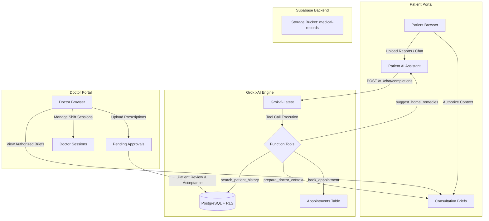

# Swasth+ (Swasth)

[](https://react.dev/)
[](https://www.typescriptlang.org/)
[](https://vitejs.dev/)
[](https://supabase.com/)
[](https://console.xai.com/)
[](LICENSE)

Swasth+ is an open-source, AI-augmented healthcare platform designed to simplify patient care and streamline doctor workflows. By combining an autonomous **Grok (xAI)** health assistant with a dual-sided clinical dashboard, Swasth+ turns fragmented patient histories and diagnostic reports into actionable, doctor-authorized clinical briefs before appointments even begin.

---

## The Problem & Why We Built Swasth

In standard outpatient consultations, doctors often spend **4 out of 10 minutes** flipping through paper reports, re-asking historical medical questions, or trying to decipher past prescriptions. Meanwhile, patients forget critical symptom timelines or feel unprepared during their visits.

**Swasth+ solves this by:**
1. **Giving patients an intelligent companion** that analyzes medical reports (PDFs, images), provides home-care guidance, and tracks health milestones.
2. **Pre-packaging patient context** into a doctor-ready briefing that the patient explicitly authorizes before stepping into the clinic.
3. **Enforcing strict privacy** using Supabase Row Level Security (RLS) so patients always own and control access to their health records.

---

## System Architecture



---

## Core Features

### 🩺 1. Autonomous Grok AI Companion & Multimodal Vision
- **Interactive Health Chat**: Answers patient queries with context drawn directly from their stored document index.
- **Multimodal Report Analysis**: Parses uploaded medical images, blood reports, and PDFs using Grok's vision processing to extract relevant clinical insights.
- **Live Tool Execution**: Grok autonomously triggers backend functions:
  - `suggest_home_remedies` — Recommends safe care protocols for mild symptoms.
  - `search_patient_history` — Queries past diagnostic uploads for matching keywords.
  - `prepare_doctor_context` — Synthesizes complex patient histories into concise medical summaries.
  - `find_best_doctor` — Matches symptoms against registered doctor specialties.
  - `book_appointment` — Books consultation slots directly in the database.

### 📜 2. Patient-Authorized Clinical Briefings
- Before an appointment, patients generate and review an AI-synthesized brief.
- Patients select which doctor receives access. Doctors see only authorized briefs and explicitly attached files on their dashboard.

### 🔄 3. Doctor-to-Patient Record Staging
- Doctors can upload prescriptions or lab requests directly to a patient's profile.
- Files land in a `pending_document_uploads` state, giving patients full control to accept or reject incoming files.

### 📅 4. Doctor Shift & Schedule Manager
- Doctors create available consultation blocks with custom time slots and max patient limits.
- Patients view available shifts in real time and request appointments without back-and-forth messaging.

### ⏱️ 5. Chronological Health Timeline
- Automatically logs milestones: completed appointments, AI home remedy consultations, diagnostic report uploads, and doctor-approved prescriptions.

---

## Router & Entrypoints Guide

| Route | Component | Access Role | Function |
| :--- | :--- | :--- | :--- |
| `/` | `modules/patient/Home.tsx` | Public | Platform overview, features, and patient quick access |
| `/doctors` | `modules/doctor/DoctorLanding.tsx` | Public | Practitioner network page & doctor onboarding info |
| `/login` | `modules/shared/Login.tsx` | Public | Unified sign-in and account creation |
| `/patient-dashboard` | `modules/patient/PatientDashboard.tsx` | Patient | AI health assistant, document uploads, and health timeline |
| `/patient-doctors` | `modules/patient/Doctors.tsx` | Patient | Search doctors by specialty & view available slots |
| `/patient-appointments`| `modules/patient/Appointments.tsx` | Patient | View scheduled consultations & status updates |
| `/patient-messages` | `modules/patient/Messages.tsx` | Patient | Communication hub & system alerts |
| `/patient-settings` | `modules/patient/Settings.tsx` | Patient | Update personal details & medical history profile |
| `/doctor-dashboard` | `modules/doctor/DoctorDashboard.tsx` | Doctor | Clinical overview, authorized briefs, and patient list |
| `/doctor-schedule` | `modules/doctor/Schedule.tsx` | Doctor | Create consultation slots & set patient quotas |
| `/doctor-patients` | `modules/doctor/Patients.tsx` | Doctor | Access authorized patient files and histories |
| `/doctor-settings` | `modules/doctor/Settings.tsx` | Doctor | Update specialty info, qualifications, and profile |
| `/document/:id` | `modules/shared/DocumentView.tsx` | Authenticated | View lab reports, diagnostic images, or PDFs |

---

## Database & Security Architecture

Swasth+ uses **Supabase PostgreSQL** with strict Row Level Security (RLS) to ensure data isolation between patients and doctors.

### Tables Breakdown

- **`users`**: Extends `auth.users` with user roles (`patient` or `doctor`), names, and medical specialties.
- **`documents`**: Stores uploaded medical records with extracted text, file URLs, and owner IDs.
- **`consultation_briefs`**: AI-generated briefs authorized by patients for specific doctors.
- **`appointments`**: Manages booking states (`pending`, `confirmed`, `rejected`), dates, times, and remarks.
- **`health_milestones`**: Records chronological health actions (AI bookings, report uploads, consultations).
- **`pending_document_uploads`**: Holds doctor-uploaded files until accepted by the target patient.
- **`ai_chat_sessions` & `ai_chat_messages`**: Persists AI conversation history and tool execution logs per patient.
- **`doctor_sessions`**: Defines doctor shift schedules and max patient capacities.

All tables are secured via RLS policies defined in [`database.sql`](database.sql).

---

## Getting Started

### Prerequisites

- **Node.js**: v18.0 or higher
- **Package Manager**: `pnpm` (recommended) or `npm`
- **Supabase Account**: A free Supabase project instance
- **xAI Grok API Key**: Obtained from the [xAI Developer Console](https://console.xai.com/)

### Step 1: Clone the Repository

```bash
git clone https://github.com/EliteDebuggers/Swasth.git
cd Swasth
```

### Step 2: Install Dependencies

```bash
pnpm install
```

### Step 3: Configure Environment Variables

Create a `.env` file in the root directory:

```env
# Grok (xAI) API Key & Model Configuration
VITE_GROK_API_KEY=xai-YOUR_GROK_API_KEY
VITE_GROK_MODEL=grok-2-latest

# Supabase Project Credentials
VITE_SUPABASE_URL=https://your-project-id.supabase.co
VITE_SUPABASE_ANON_KEY=your-supabase-anon-key
```

### Step 4: Setup Supabase Database

1. Open your project on the [Supabase Dashboard](https://supabase.com/dashboard).
2. Go to the **SQL Editor**.
3. Copy the entire contents of [`database.sql`](database.sql) into the editor and click **Run**.
4. This will set up all 9 tables, indexes, storage buckets (`medical-records`), and RLS policies.

### Step 5: Start the Development Server

```bash
pnpm dev
```

Open `http://localhost:5173` in your browser.

### Step 6: Build for Production

```bash
pnpm build
pnpm preview
```

---

## Technical Deep-Dive: Grok Tool Integration

The AI engine in [`src/modules/patient/components/PatientAIAssistant.tsx`](src/modules/patient/components/PatientAIAssistant.tsx) connects directly to Grok via the standard OpenAI-compatible completions API:

```ts
const res = await fetch('https://api.xai.com/v1/chat/completions', {
  method: 'POST',
  headers: {
    'Content-Type': 'application/json',
    'Authorization': `Bearer ${apiKey}`
  },
  body: JSON.stringify({
    model: 'grok-2-latest',
    messages: formattedMessages,
    tools: toolDeclarations,
    temperature: 0.3
  })
});
```

When Grok responds with `tool_calls`, the client parses arguments, executes the corresponding Supabase query or state update, appends the `tool` role message to the prompt, and requests the next turn from Grok. This pattern enables multi-step agentic behavior entirely within the client application.

---

## FAQ & Troubleshooting

<details>
<summary><b>1. What happens if VITE_GROK_API_KEY is not set?</b></summary>
The UI will alert the user to set `VITE_GROK_API_KEY` in their `.env` file. Non-AI features (document uploads, manual appointment booking, schedule management) will continue to work normally.
</details>

<details>
<summary><b>2. How does document OCR / text extraction work?</b></summary>
When a user attaches an image file, it is sent to Grok as a base64 Data URL (`image_url` object) in the messages array. Grok performs vision analysis directly on the image content.
</details>

<details>
<summary><b>3. Why are doctors unable to see a patient's documents initially?</b></summary>
By design, all documents are protected by Supabase RLS. Doctors can only view documents attached to an authorized `consultation_brief` or uploaded directly by that doctor.
</details>

---

## Team & License

Built with ❤️ by **Team EliteDebuggers**.

Distributed under the **GNU License**. See `LICENSE` for details.
